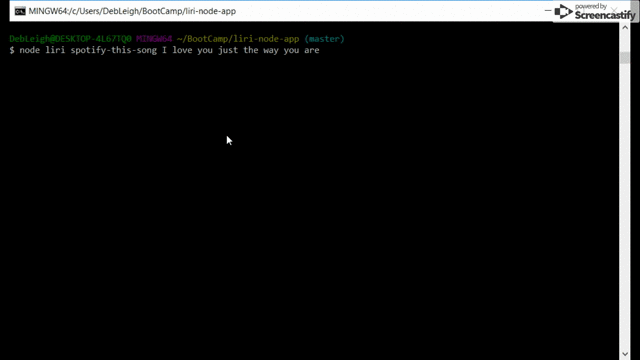
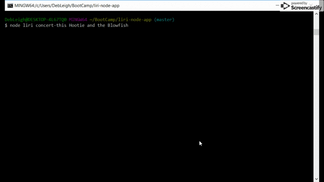
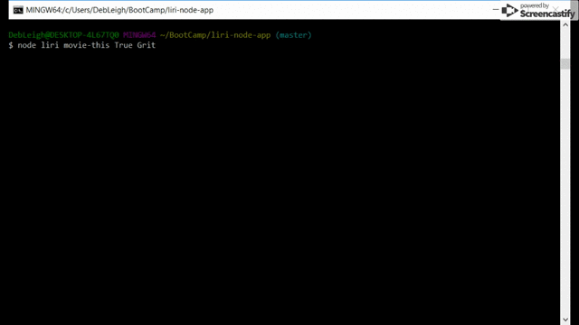
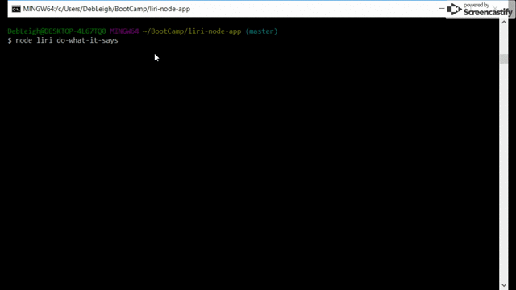
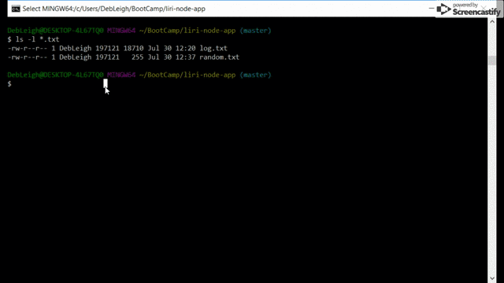

# liri.js - Who needs Siri when you can have Liri?

Developed by Deb Warrick https://debwarrick.com

**liri** 
It is a Node.js app that will allow you to retrieve information from the Spotify,BandsinTown,and OMDB APIs based on your user input.

liri can't be run from a URL, it must be executed using Node.js.

## How it works

You can enter one of the following commands after the node and program commands (node liri), followed by search criteria

**spotify-this-song** *songname*   information about a selected song.  Will default to "The Sign" if no search criteria entered.
**concert-this**      *bandname*   concert dates for the selected band.  Will default to "Maroon 5" if no search criteria entered.  
**movie-this**        *moviename*  information for selected movie title.  Will default to "Mr. Nobody" if no search criteria entered.  
**do-what-it-says**                will select a random command and option from those that had previously been requested.  No search criteria is required. 

## Additional Features

#### All entries are case insensitive

#### Can't remember the commands?  No problem, neither could I! 

Node liri without any criteria will prompt you to select from a list.

It will only prompt for the "selection criteria" if the command allows for that.

Examples of this functionality are in the example images below

#### Each time you successfully run the app (except do-what-it-says), your entry will be added to the random selection list.
This will be used for future selection by the do-what-it-says option, allowing you to create your own random playlist.

#### Want to see what you've run?
The output from each selection is stored in log.txt for easy and future viewing.

#### Examples

##### node liri spotify-this-song I love you just the way you are

##### node liri concert-this Hootie and the Blowfish

##### node liri movie-this True Grit 

##### node liri do-what-it-says  

##### Log files

## Technical requirements

### liri uses the following Node.js libraries that you must install.

**inquirer** - to allow for the prompts for the execution.  
**keys** - API keys are stored in a .env file to protect them.  
**node-spotify-api** - for calls to the Spotify API.  
**axios** - for API calls to BandsinTown API and the OMDB API.  
**moment** - for date conversion.  
**fs** - for file I/O.  

You must have valid Spotify credentials loaded into a .env file in order to run it.

## Thank you for checking it out, and have fun!
